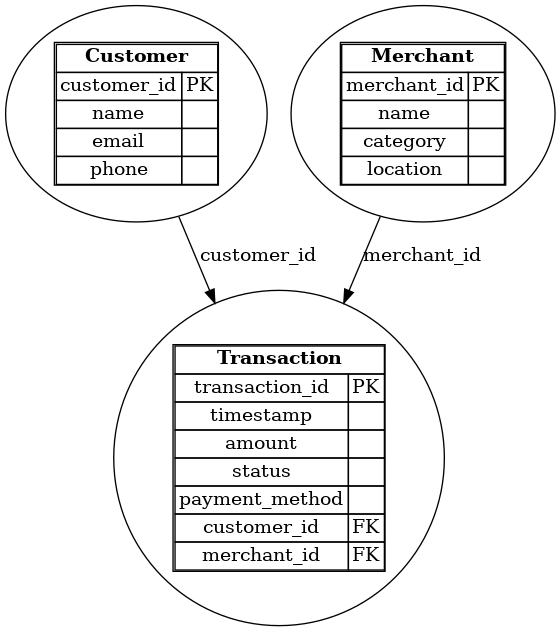

# Kafka Streaming Project - Flash Sale Transactions Simulation

## Project Objective
This project simulates a real-time streaming data pipeline for banking or flash sale transactions using Kafka (Redpanda).  
It demonstrates data production, consumption, storage, and visualization with multiple consumers.

---

## Components

1. **Producer.py**  
Simulates fake streaming transaction data and publishes messages to a Kafka topic.

2. **Consumer-1.py**  
Consumes messages from Kafka and inserts transaction data into a PostgreSQL database.

3. **Consumer-2.py**  
Consumes messages from Kafka and visualizes the transactions in real-time.

4. **Redpanda Kafka Broker and Console**  
Redpanda serves as the Kafka broker with a web console to monitor topics and messages.

## Prerequisites

- Docker & Docker Compose  
- Python 3.8+  
- PostgreSQL database  
- Kafka client libraries (`kafka-python`)  

---
## ER Diagram



---

## Setup & Run Instructions

### 1. Start Kafka Broker and Console (Redpanda)

```bash
docker-compose -f docker-compose.yaml up -d

Access console at: http://192.168.10.21:2048
